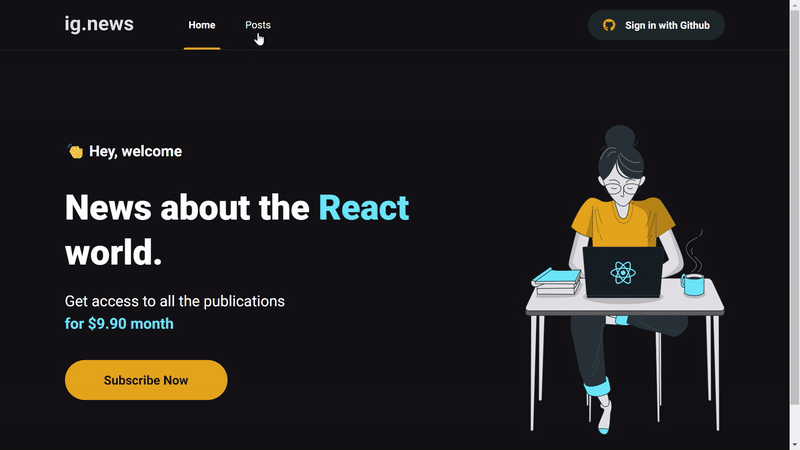

<h1 align="center">ignews</h1>

<p align="center">Blog desenvolvido no Ignite de React.js da Rocketseat para aprender Next.js e seus fundamentos, e utilizar funções back-end (serverless) para a comunicação com uma plataforma de pagamentos (Stripe), banco de dados (FaunaDB) e o CMS (Prismic CMS).</p>

<p align="center">
  
</p>

<h1 align="left">🎯 O projeto </h1>

<p> O ignews é um blog feito com Next.js! <br/>
Essa aplicação foi desenvolvida durante o curso Ignite da Rocketseat </p>

<h1 align="left">🛠️ Tecnologias </h1>

- [React](https://pt-br.reactjs.org/)
- [Next.js](https://nextjs.org/)
- [Typescript](https://www.typescriptlang.org/)
- [Sass](https://sass-lang.com/)
- [Stripe](https://stripe.com/en-br)
- [FaunaDB](https://fauna.com/)
- [Prismic CMS](https://prismic.io/)
- [Next-Auth](https://next-auth.js.org/)

<h1 align="left">⚙️ Instalação </h1>

### 🔙 Pré-requisitos

Antes de começar, você vai precisar ter instalado em sua máquina as seguintes ferramentas:
[Git](https://git-scm.com), [Node.js](https://nodejs.org/en/) e [Yarn](https://yarnpkg.com/). </br>
Além disso é bom ter um editor para trabalhar com o código como o [VSCode](https://code.visualstudio.com/)

### 🔽 Clonando o repositório
```bash
$ git clone https://github.com/victorsantss/ignews.git
```

### 🖥️ Iniciando a aplicação

```bash
# Acesse a pasta do projeto no terminal/cmd
$ cd ignews

# Instale as dependências
$ yarn install

# Execute a aplicação
$ yarn dev

# O servidor inciará na porta:3000 - acesse <http://localhost:3000>
```

### 🔗 Link do projeto online

[ignews](https://ignews-victorsantss.vercel.app/)

<hr />

<p align="center">This project was made with 💙 by Victor Santos</p>
